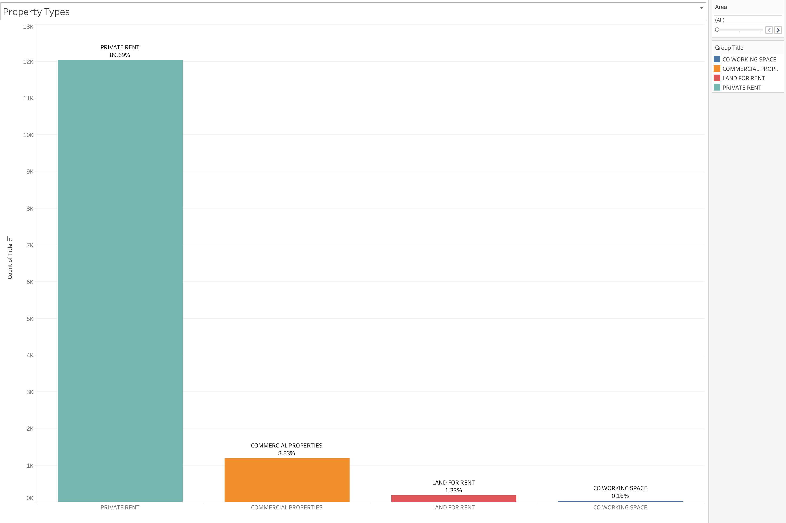
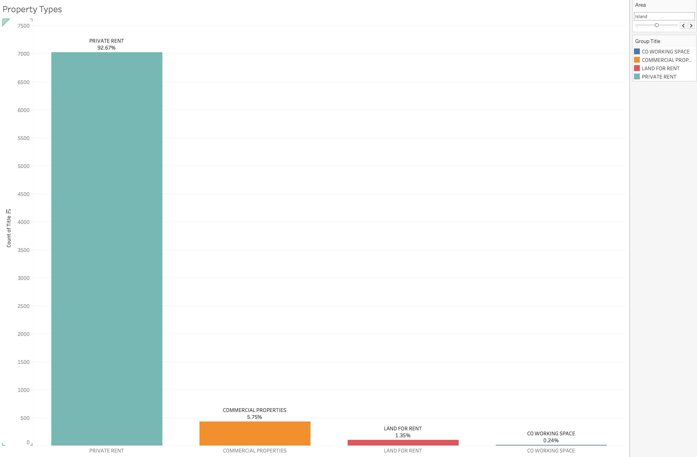
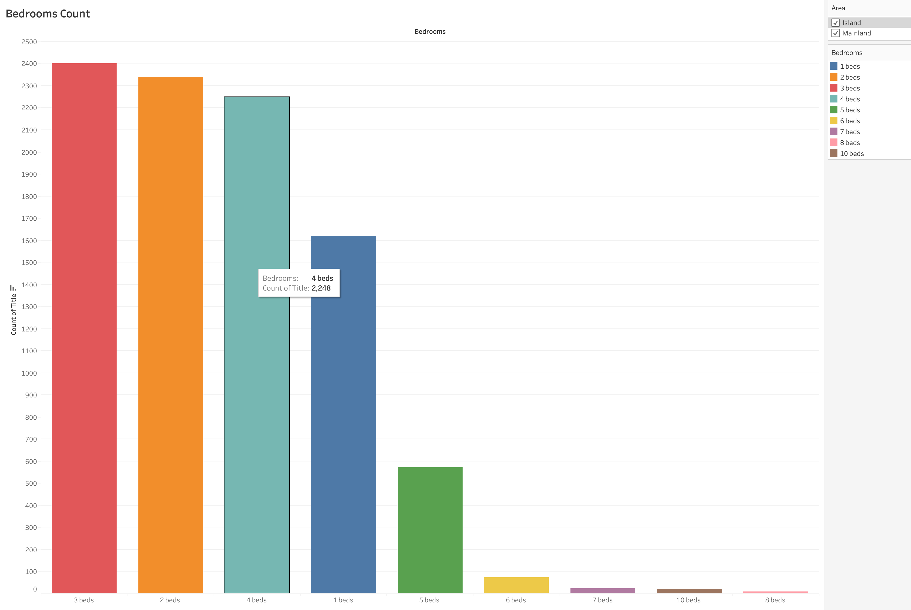

# REAL ESTATES IN LAGOS

## LAGOS STATE:

Lagos City is the most populous city in Nigeria as well as Africa with an estimated population of 21 million in 2015. The estimated population for Lagos city was more than 24 million in 2022; and around 30 million for the Lagos metropolitan area, including the suburban area reaching far into the neighbouring Ogun State, thus making Lagos the most populous urban area in Africa. Lagos was the national capital of Nigeria until December 1991 following the government's decision to move their capital to Abuja in the centre of the country. Lagos is a major African financial centre and is the economic hub of Lagos State and Nigeria at large. The city has been described as the cultural, financial, and entertainment capital of Africa, and is a significant influence on commerce, entertainment, technology, education, politics, tourism, art, and fashion. Lagos is also among the top ten of the world's fastest-growing cities and urban areas. The megacity has the fourth-highest GDP in Africa and houses one of the largest and busiest seaports on the continent.The Lagos metropolitan area is a major educational and cultural centre in Sub Saharan Africa. Due to the large urban population and port traffic volumes, Lagos is classified as a Medium-Port Megacity.

## RENTAL PROPERTIES IN LAGOS:

**This analysis is on Lagos state rental properties**

---

* Lagos has a large rental market due to its population density and the influx of people seeking opportunities in the city.
*  Renting is a popular option, especially for individuals who may not be ready to invest in property. 
*  Rental prices vary depending on location, property type, and amenities.

### MAIN AREAS:

Lagos geographical location is divided into two areas:
* Island
* Mainland

* There are more properties listed for rent on the island compared to the mainland.
* This signals more people are focused on investing in real estate on the Lagos Island
* About 43% of the properties listed are on the mainland
* The common price to rent properties on the island is N3,000,000
* The common price to rent properties on the island is N1,500,000
---

### RENTAL PROPERTY TYPES
1. Private properties
2. Commercial properties
3. Land
4. Co-working spaces

---
* 89.6% of the listed properties are private properties which includes different types of houses, i.e duplex, flats, terrace
* 8.8% are commercial properties like shops, warehouses and offices
* About 1.5% of the properties are lands and co-working spaces

Island Properties             |  Mainland Properties
:-------------------------:|:-------------------------:
  |  

* Mainland area has the highest percentage for commercial properties
* Island area has the highest percentage for private properties

### HOUSING

Generally, there are more 3 bedrooms apartments listed for rent in Lagos. Three bedrooms houses are either flats or duplex.
There are a total of 3,165 Duplex/Terrace listings, 749 Duplexes on the Mainland while there are 2,416 on the Island

### RENTAL PRICES

* The average cost of rental properties on the Island is N3,000,0000
* The average cost of rental properties on the Mainland is N1,500,000

#### ONE BEDROOM

* The average price of One bedroom flat on the Island is N1,200,000 while the price in the Mainland is N700,000.

#### TWO BEDROOM

* The average price of two bedroom house on the Island is N2.7M while the price in the Mainland is N1.3M

#### THREE BEDROOM

* The average price of a three bedroom house on the Island is 3.5M and 1.5M on the Mainland.

#### FOUR BEDROOM DUPLEX AND FLAT

##### DUPLEX
* The average price of rent for a four bedroom duplex is cheaper on the Island than the mainland which is due to the fact that there are more 4 bedroom duplexes on the Island than it is on the Mainland.
* The average price on the Mainland stands at N5,000,000 while it is N4,000,000 on the Island.

##### FLAT
* The average price for a four bedroom flat on the mainland is N3,500,000 and 4,500,000 on the Island.
