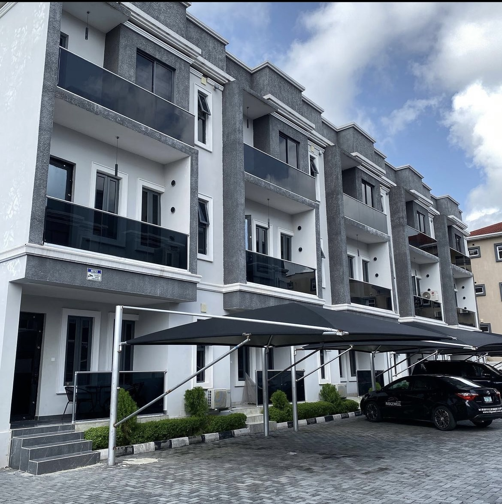
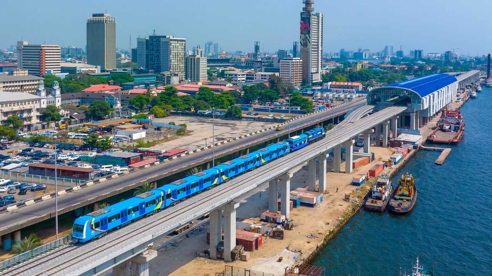
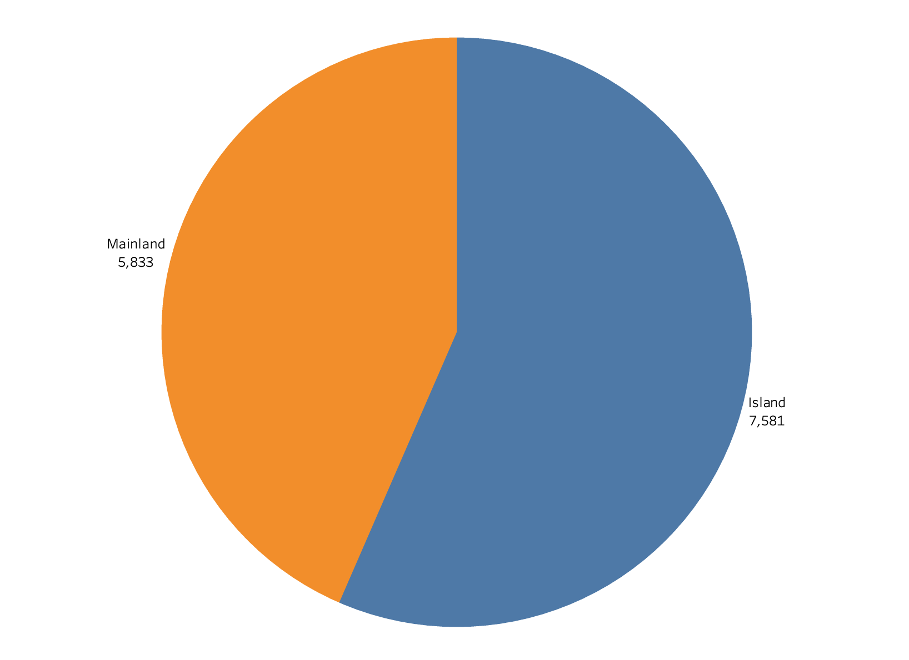

# REAL ESTATES IN LAGOS

## LAGOS STATE:

Lagos or Lagos City (Nigerian English: /ˈleɪɡɒs/; Yoruba: Èkó) is the most populous city in Nigeria as well as Africa with an estimated population of 21 million in 2015. The estimated population for Lagos city was more than 24 million in 2022; and around 30 million for the Lagos metropolitan area, including the suburban area reaching far into the neighbouring Ogun State, thus making Lagos the most populous urban area in Africa. Lagos was the national capital of Nigeria until December 1991 following the government's decision to move their capital to Abuja in the centre of the country. Lagos is a major African financial centre and is the economic hub of Lagos State and Nigeria at large. The city has been described as the cultural, financial, and entertainment capital of Africa, and is a significant influence on commerce, entertainment, technology, education, politics, tourism, art, and fashion. Lagos is also among the top ten of the world's fastest-growing cities and urban areas. The megacity has the fourth-highest GDP in Africa and houses one of the largest and busiest seaports on the continent.The Lagos metropolitan area is a major educational and cultural centre in Sub Saharan Africa. Due to the large urban population and port traffic volumes, Lagos is classified as a Medium-Port Megacity.

## LAGOS STATE RENTAL PROPERTIES :

**This analysis is on Lagos state rental properties**

---

* Lagos has a large rental market due to its population density and the influx of people seeking opportunities in the city.
*  Renting is a popular option, especially for individuals who may not be ready to invest in property. 
*  Rental prices vary depending on location, property type, and amenities.

### MAIN AREAS:

Lagos geographical location is divided into two areas:
* Island
* Mainland

* There are more properties listed for rent on the island compared to the mainland.
* This signals more people are focused on investing in real estate on the Lagos Island
* About 43% of the properties listed are on the mainland
* The common price to rent properties on the island is N3,000,000
* The common price to rent properties on the island is N1,500,000
---

### RENTAL PROPERTY TYPES
1. Private properties
2. Commercial properties
3. Land
4. Co-working spaces

